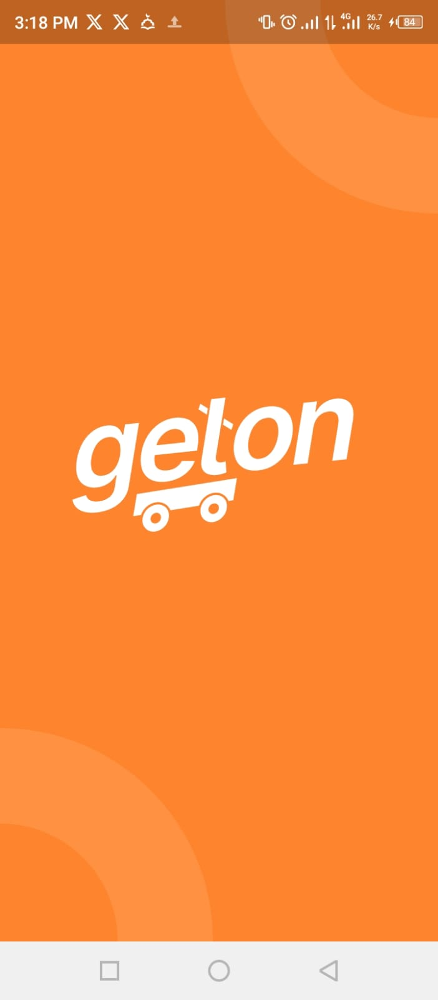
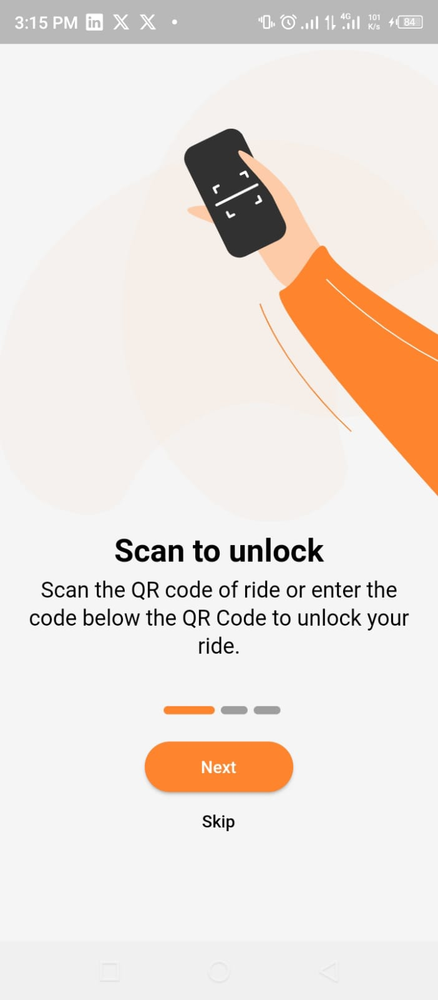
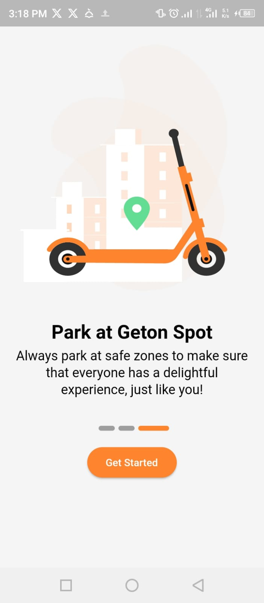
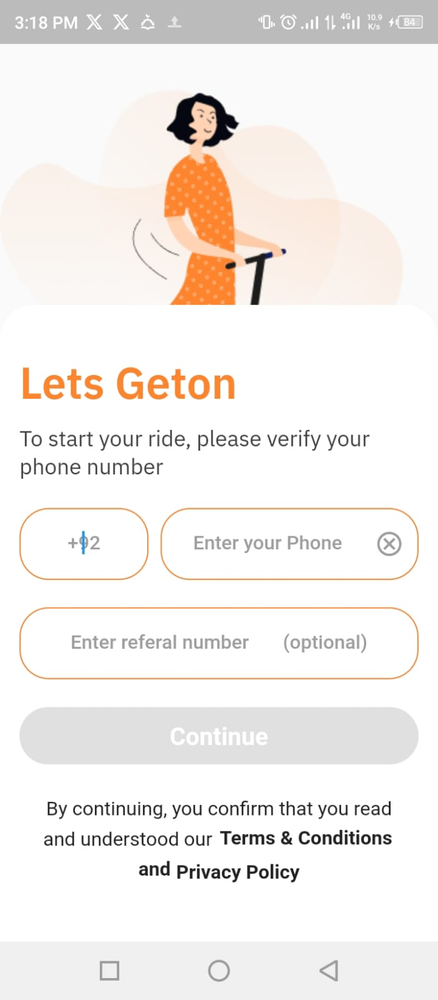
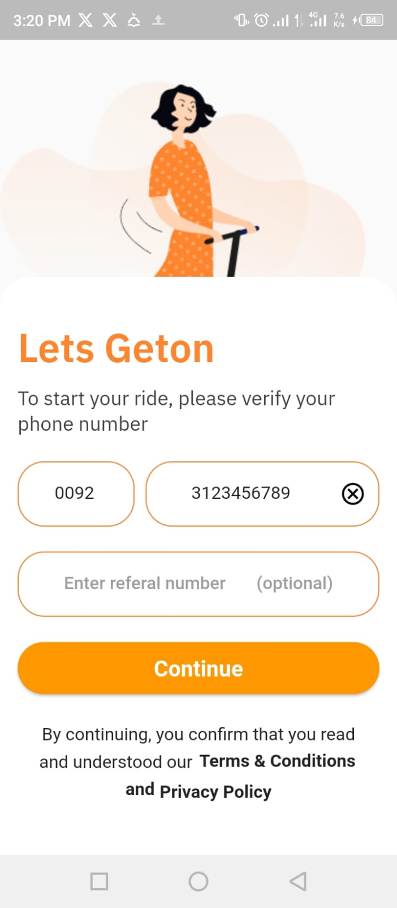

**Geton - Stunning UI for your Onboarding and Splash Screens**

Welcome to Geton, your all-in-one solution for a seamless App dev adventure. Geton is a cutting-edge application meticulously crafted using Flutter. It incorporates a multitude of features designed to elevate your shopping journey. Here is a single Feature Provided (whihc is UI of Onboarding Screen and User Verification Screen)!

**Features**

- **In-App Animator:** Experience a mesmerizing onboarding animation the first time you open the app, making your first interaction unforgettable.

- **User Verification:** Geton offers an aesthetically pleasing user verification code interface, adding style to your experience.

- **Splash Screen:** Design your shopping journey App with an eye-catching splash screen that sets the tone for a delightful experience.

- **Google Fonts Integration:** We've integrated Google Fonts to deliver a visually stunning and unique UI, making every interaction a pleasure.

**Screenshots**

  
  

  
  
  

**Getting Started**

Embark on your Geton journey with these simple steps:

1. Clone the repository to your local machine.
2. Personalize the app to match your business requirements.
3. Build and launch the app on your preferred platform.

Get ready for an unparalleled shopping adventure with Geton!
